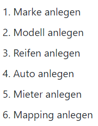

# BS_2022_DB [Helfer / Geiser]
## Anleitung zum erstellen eines Mietvorgangs
 
Wichtig: Befolgen Sie strickt die Reihenfolge!

## Folgende SQL-Select-Statements wurden eingesetzt:
1. SELECT * FROM module_modells
2. SELECT * FROM module_reifen
3. SELECT * FROM module_autos, module_modells, module_reifen, module_marken WHERE module_autos.uuid_reifen = module_reifen.uuid_reifen AND module_autos.uuid_modell = module_modells.uuid_modell AND module_modells.uuid_marken = module_marken.uuid_marken
4. SELECT * FROM module_marken
5. SELECT * FROM module_mieter
6. SELECT * FROM module_autos, module_modells, module_reifen, module_marken WHERE module_autos.uuid_modell = module_modells.uuid_modell AND module_modells.uuid_marken = module_marken.uuid_marken AND module_autos.uuid_reifen = module_reifen.uuid_reifen
7. SELECT * FROM module_mieter
8. SELECT * FROM module_map_auto_mieter, module_mieter, module_autos, module_modells WHERE module_map_auto_mieter.uuid_mieter = module_mieter.uuid_mieter AND module_autos.uuid_auto = module_map_auto_mieter.uuid_auto AND module_autos.uuid_modell = module_modells.uuid_modell;
9. SELECT COUNT(uuid_auto) as counter FROM module_autos;
10. SELECT COUNT(uuid_mieter) as counter FROM module_mieter;
11. SELECT COUNT(uuid_mieter) as counter FROM module_map_auto_mieter;
12. SELECT COUNT(uuid_modell) as counter FROM module_modells;
13. SELECT COUNT(module_map_auto_mieter.uuid_auto) as counter FROM module_map_auto_mieter, module_autos, module_marken, module_modells WHERE module_map_auto_mieter.uuid_auto = module_autos.uuid_auto AND module_autos.uuid_modell = module_modells.uuid_modell AND module_marken.uuid_marken = module_modells.uuid_marken
14. SELECT COUNT(module_map_auto_mieter.uuid_mieter) as counter FROM module_map_auto_mieter, module_mieter WHERE module_mieter.uuid_mieter=module_map_auto_mieter.uuid_mieter;
15. SELECT COUNT(*) as counter FROM module_autos, module_map_auto_mieter, module_marken, module_mieter, module_reifen;

## ER-Diagramm

## Relationsschreibweise

